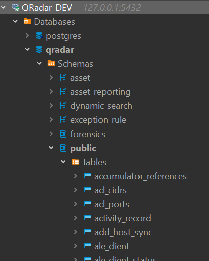

# Remote access to QRadar Postgres DB

Note: This will work *without* modifying the default ssh and postgres restrictions in QRadar.

\
The connection is:

`DBeaver -> 127.0.0.1:5432 (ssh tunnel) -> QRADAR Console -> port 55432 (SOCAT) -> postgres unix socket`

\
On QRadar, create a socat listener on port 55432, pointing to the postgres socket:

    socat -d -d -d TCP-LISTEN:55432,reuseaddr,fork UNIX-CLIENT:/var/run/postgresql/.s.PGSQL.5432

\
On the controlling machine, open an SSH tunnel-only connection to QRadar:

    ssh -nNT -o ServerAliveInterval=15 -L 127.0.0.1:5432:127.0.0.1:55432 root@QRADAR-CONSOLE

\
Now you can configure DBeaver:

`Host: 127.0.0.1`

`Port: 5432`

`Username: qradar`

\

\
And enjoy browsing the DB with a GUI:

